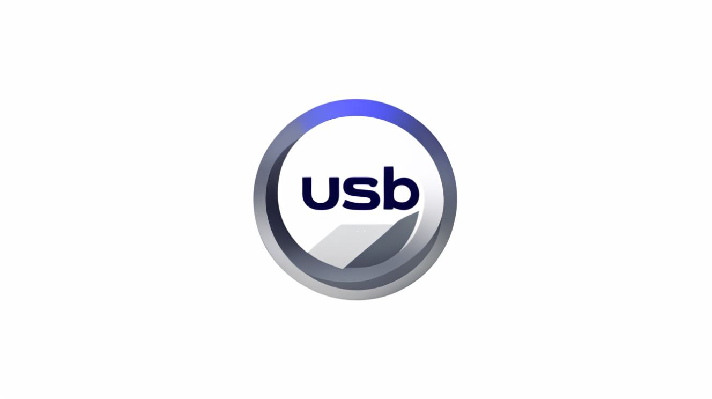

# USB Vault 🔒

<a href="LICENSE"></a>
[](https://dotnet.microsoft.com/)
[](https://www.microsoft.com/windows)
[](https://t.me/your_tg)
[](https://tiktok.com/@your_tiktok)
[](https://www.buymeacoffee.com/your_profile)

 <!-- Замените logo.png на ваше изображение -->

## 📌 О проекте
**USB Vault** - это безопасное хранилище заметок с использованием USB-флешки в качестве ключа шифрования. Ваши данные защищены AES-256 и доступны только при подключенном USB-носителе.

🔹 **Ключевые особенности**:
- Шифрование данных "на лету" в оперативной памяти
- Автоматическая блокировка при извлечении флешки
- Поддержка нескольких независимых хранилищ
- Простой консольный интерфейс
- Полная анонимность - не требует интернета и регистрации

## 🚀 Быстрый старт
1. Скачайте последнюю версию из [раздела Releases](https://github.com/yourusername/USBVault/releases)
2. Распакуйте архив в любую папку
3. Запустите `USBVault.exe`
4. Создайте новый USB-ключ (программа проведет вас через процесс)

## 🛠 Сборка из исходников
**Требования**:
- Windows 10/11
- Visual Studio 2022 (Community версии достаточно)
- .NET 8 SDK x64

**Инструкция**:
```bash
git clone https://github.com/yourusername/USBVault.git
cd USBVault
dotnet build --configuration Release
```
